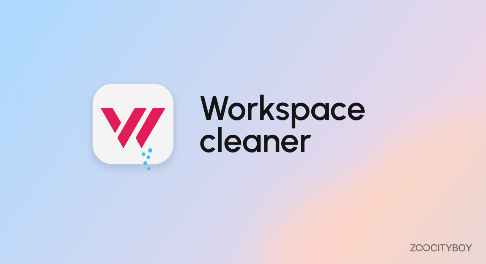

# Melos Workspace Cleaner

Melos Workspace Cleaner is a tool designed for cleaning monorepo workspaces built on the [Melos](https://melos.invertase.dev/~melos-latest).
This tool provides an straightforward solution for maintaining and managing your monorepo project,
especially when dealing with an extensive codebase or a multi-project environment.

Optimize your development process and enhance code management with
this workspace cleaning tool, when you switching between branches.

## Features

- [X] Custom pattern definitions using [glob](https://pub.dev/packages/glob) pattern
- [X] Integration option using Melos Hooks
- [X] Simplification of dependency_overrides removal process

## 🚀  Getting started

### Installation

```bash
dart pub global activate mwc
```

## Usage

```bash
mwc
```

```yaml
# melos.yaml
name: workspace
command:
  clean:
    hooks:
      pre: mwc
  
```

